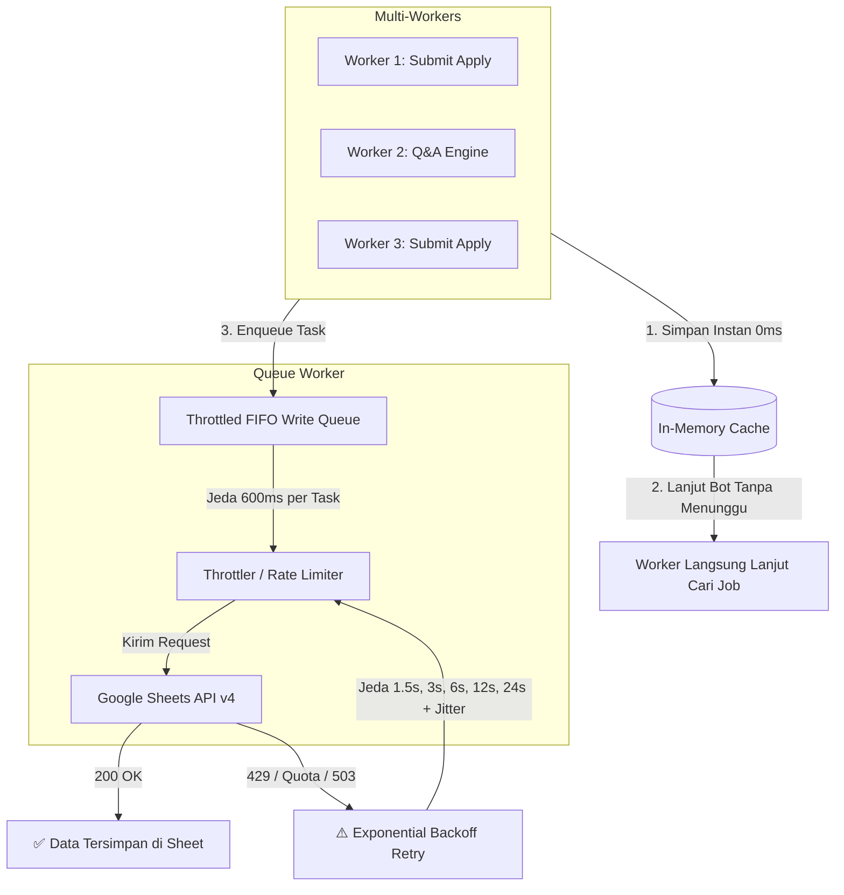

# Mekanisme Antrean & Limit Google Sheets API

Dokumen ini menjelaskan arsitektur antrean penulisan (*Write Queue*), ketahanan kuota (*Rate Limit Resilience*), dan penanganan konkurensi (*Multi-Worker/Multi-Tab Concurrency*) saat CV Blaster berinteraksi dengan Google Sheets API.

---

## 1. Batas Kuota Google Sheets API

Secara default, Google Cloud memberlakukan batasan kuota gratis untuk Google Sheets API v4:

| Jenis Operasi | Kuota Default Google | Dampak jika Terlampaui |
| :--- | :--- | :--- |
| **Write Requests** (Append, Update, Batch) | **60 request / menit** per user/project | HTTP 429 (`RESOURCE_EXHAUSTED`) |
| **Read Requests** (Get Values, Get Sheets) | **60 request / menit** per user/project (maks 300/project) | HTTP 429 (`RESOURCE_EXHAUSTED`) |

---

## 2. Tantangan pada Multi-Worker / Multi-Tab Bot

Ketika Anda mengaktifkan **Worker Konkuren** (misalnya 3 hingga 5 worker bot LinkedIn / Jobstreet berjalan serentak):
1. **Pencegahan Kolisi:** Beberapa worker dapat menyelesaikan proses *Easy Apply* atau menjawab *Screening Questions* dalam detik yang sama.
2. **Lonjakan Request (Burst):** Tanpa mekanisme antrean, puluhan permintaan penulisan baris akan dikirim ke endpoint Google secara paralel, memicu error:
   ```text
   HTTP 429: Too Many Requests
   Quota exceeded for quota metric 'Write requests' per minute per user
   ```
3. **Risiko Kehilangan Data:** Jika request gagal tanpa *retry*, catatan lamaran yang baru saja dikirim atau jawaban pertanyaan baru bisa hilang (*dropped*).

---

## 3. Arsitektur Antrean & Penanganan Konkurensi

CV Blaster mengimplementasikan sistem antrean berlapis di [`src/lib/googleSheets.ts`](file:///Users/yoga/Developer/Personal/CV%20blaster/src/lib/googleSheets.ts):



---

## 4. Rincian Komponen Proteksi

### A. In-Memory Cache Instan (Non-Blocking Workers)
- **Kecepatan 0ms:** Begitu worker berhasil melamar lowongan (`addAppliedJob`) atau menjawab pertanyaan baru (`appendQuestionToSheet`), data langsung dicatat ke cache memori lokal.
- **Bebas Kolisi:** Worker lain yang memeriksa `isJobAlreadyApplied(url)` langsung mendapatkan status *sudah dilamar*, mencegah pengiriman lamaran ganda ke lowongan yang sama.
- **Worker Tidak Terhambat:** Bot tidak perlu menunggu response HTTP dari Google Sheets untuk beralih ke lowongan berikutnya.

### B. Serialized FIFO Write Queue (`enqueueSheetsWrite`)
- Seluruh penulisan ke Google Sheets dimasukkan ke dalam antrean tunggal (*First-In, First-Out*).
- Diberikan jeda interval minimal **~600ms** antar eksekusi penulisan.
- Menjamin laju penulisan rata-rata maksimum adalah **~100 request / menit**, menjaga stabilitas beban dan mencegah lonjakan *burst*.

### C. Exponential Backoff & Jitter (`executeWithRetry`)
Jika terjadi pembatasan kuota (HTTP 429), `RESOURCE_EXHAUSTED`, atau kegagalan jaringan sementara (500/502/503/504), sistem otomatis mengeksekusi *retry*:

$$\text{Delay} = (\text{initialDelay} \times 2^{\text{attempt} - 1}) + \text{jitter}$$

* **Max Retries:** 5 kali percobaan.
* **Initial Delay:** 1.500 ms (1,5 detik).
* **Jitter Acak:** 0 - 500 ms (mencegah fenomena *thundering herd*).
* **Rentang Percobaan:** ~1.5 detik $\rightarrow$ ~3.2 detik $\rightarrow$ ~6.4 detik $\rightarrow$ ~12.8 detik $\rightarrow$ ~25.6 detik.

### D. Header Tab Initialization Caching
- Pengecekan dan inisialisasi header kolom (`initializeSheet` dan `initializeQuestionsSheet`) dicatat dalam *set cache* `initializedTabs`.
- Sistem tidak akan memanggil API Google berulang kali hanya untuk memastikan header tab ada di setiap kali baris baru ditambahkan.

---

## 5. Pemantauan & Log Terminal

Ketika Google Sheets API mulai membatasi request karena kuota padat, sistem akan menampilkan log peringatan yang informatif di terminal / konsol:

```log
⚠️ [Google Sheets API Quota] Append Applied Job [PT Tech Maju - Frontend Dev] terkendala (Rate Limit 429 / Quota Exceeded). Menunggu 3.2s sebelum mencoba kembali (Percobaan 1/5)...
```

Setelah jeda backoff selesai, request akan dicoba ulang secara otomatis hingga berhasil tersimpan tanpa intervensi manual.
