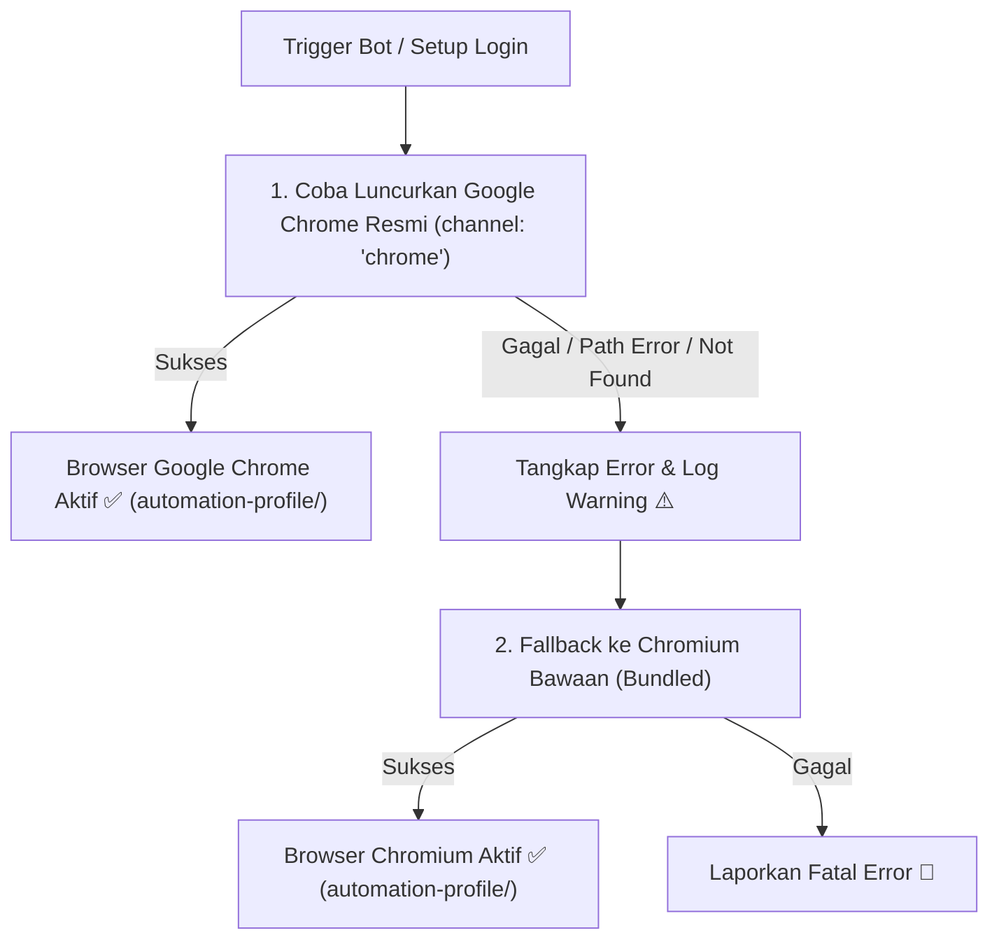

# Panduan & Rencana Implementasi: Menggunakan Google Chrome Asli dengan Automatic Fallback ke Chromium

Dokumen ini menjelaskan bagaimana mengonfigurasi Puppeteer di proyek **CV Blaster** agar menggunakan **Google Chrome resmi (System Chrome)** sebagai prioritas utama, lengkap dengan **Automatic Fallback ke Chromium bawaan** jika Google Chrome gagal atau tidak ditemukan, dengan tetap mempertahankan session login di folder `automation-profile/`.

---

## 🎯 1. Mengapa Menggunakan Google Chrome Asli + Automatic Fallback?

| Fitur | Google Chrome Resmi (System Chrome) | Chromium Bawaan (Fallback) |
| :--- | :--- | :--- |
| **Prioritas Peluncuran** | **Prioritas #1 (Utama)** | **Prioritas #2 (Cadangan / Fallback)** |
| **Deteksi Anti-Bot** | Sangat kuat (fingerprint browser nyata, DRM Widevine, codec lengkap). | Berfungsi sebagai pengaman jika Chrome sistem tidak tersedia / error. |
| **Penyimpanan Sesi (`automation-profile/`)** | ✅ **Kompatibel Penuh**: Sesi, cookie, dan login disimpan di folder yang sama. | ✅ **Kompatibel Penuh**: Dapat langsung membaca sesi yang sama tanpa login ulang. |
| **Resiliensi Sistem** | - | Mencegah bot crash jika ada update atau perubahan path Chrome di OS. |

---

## 🏗️ 2. Alur Peluncuran Browser (Launch Flow)



---

## 🛠️ 3. Implementasi Kode Terpusat

### Helper: `src/lib/browserHelper.ts`
Fungsi peluncur yang menangani percobaan bertingkat (Chrome $\rightarrow$ Fallback Chromium):

```typescript
import path from 'path';
import { getConfig } from './config';

export interface LaunchBrowserResult {
  browser: any;
  browserType: 'google-chrome' | 'chromium-bundled' | 'custom-chrome';
}

export async function launchBrowserWithFallback(
  mode: 'headless' | 'headful' = 'headless',
  onLog?: (msg: string) => void
): Promise<LaunchBrowserResult> {
  const puppeteer = require('puppeteer-extra');
  const StealthPlugin = require('puppeteer-extra-plugin-stealth');
  try {
    puppeteer.use(StealthPlugin());
  } catch (e) {}

  const config = getConfig();
  const profilePath = path.join(process.cwd(), 'automation-profile');
  const isHeadless = mode !== 'headful';

  const baseArgs = [
    '--no-sandbox',
    '--disable-setuid-sandbox',
    '--disable-dev-shm-usage',
    '--disable-blink-features=AutomationControlled',
    '--window-size=1280,800'
  ];

  const baseOptions: any = {
    headless: isHeadless,
    userDataDir: profilePath,
    ignoreDefaultArgs: ['--enable-automation'],
    args: baseArgs,
    defaultViewport: isHeadless ? { width: 1280, height: 800 } : null
  };

  const log = onLog || console.log;

  // ----------------------------------------------------
  // PERCOBAAN 1: Google Chrome Resmi / Custom Path
  // ----------------------------------------------------
  if (config.useSystemChrome !== false) {
    const isCustomPath = !!(config.customChromePath && config.customChromePath.trim());
    const chromeOptions = {
      ...baseOptions,
      ...(isCustomPath ? { executablePath: config.customChromePath.trim() } : { channel: 'chrome' })
    };

    const targetLabel = isCustomPath ? `Google Chrome (${config.customChromePath})` : 'Google Chrome Resmi (System)';

    try {
      log(`🌐 Mencoba meluncurkan ${targetLabel}...`);
      const browser = await puppeteer.launch(chromeOptions);
      const version = await browser.version().catch(() => 'Unknown');
      log(`✅ Berhasil membuka ${targetLabel} [${version}]`);
      return { browser, browserType: isCustomPath ? 'custom-chrome' : 'google-chrome' };
    } catch (chromeError: any) {
      log(`⚠️ Gagal membuka ${targetLabel}: ${chromeError.message || chromeError}`);
      log(`🔄 Beralih (fallback) menggunakan Chromium bawaan Puppeteer...`);
    }
  }

  // ----------------------------------------------------
  // PERCOBAAN 2: Fallback ke Chromium Bawaan (Bundled)
  // ----------------------------------------------------
  try {
    log(`🌐 Meluncurkan Chromium Bawaan (Bundled Chromium)...`);
    const browser = await puppeteer.launch(baseOptions);
    const version = await browser.version().catch(() => 'Unknown');
    log(`✅ Berhasil membuka Chromium Bawaan [${version}]`);
    return { browser, browserType: 'chromium-bundled' };
  } catch (bundledError: any) {
    log(`🚨 Gagal meluncurkan browser Chromium: ${bundledError.message || bundledError}`);
    throw new Error(`Tidak dapat meluncurkan browser: ${bundledError.message || bundledError}`);
  }
}
```

---

## 🧪 4. Rencana Pengujian

1. **Uji Skenario Normal (Chrome Asli)**:
   - Jalankan bot / setup login $\rightarrow$ Google Chrome terbuka normal dengan session `automation-profile`.
2. **Uji Skenario Fallback**:
   - Atur path palsu di config $\rightarrow$ Sistem log warning $\rightarrow$ Otomatis fallback ke Chromium bawaan tanpa error fatal $\rightarrow$ Session `automation-profile` tetap terbaca.
